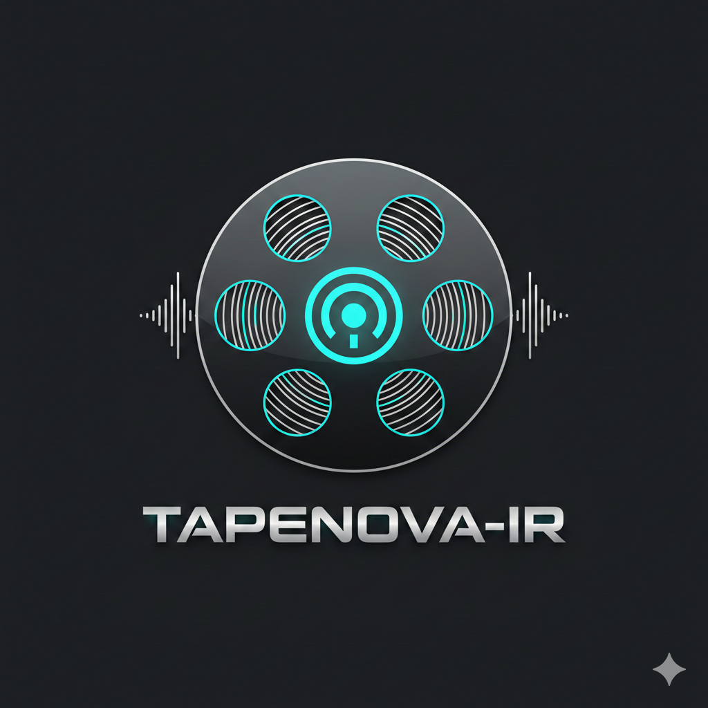

<p align="center">
  
</p>

<h1 align="center">TAPENOVA × IR</h1>

<p align="center">
  A retro-inspired, PWA-ready web audio player with animated cassette &amp; vinyl views, real-time audio metadata, and YouTube support.
</p>

<p align="center">
  
  &nbsp;&nbsp;
  
</p>

---

## 🎵 Overview

**TAPENOVA × IR** is a fully client-side web audio player inspired by the *Snowsky Echo Mini*. It combines a polished retro aesthetic — a virtual cassette Walkman and a vinyl turntable — with accurate audio metadata display (sample rate, bit depth, bitrate). No backend, no framework dependencies; pure HTML, CSS, and vanilla JavaScript.

> Built by **Ramesh Inampudi** · First release Feb 2026

---

## ✨ Features

### 🎛️ Dual Visual Modes
| 📼 Cassette (Walkman) | 💿 Vinyl (Turntable) |
|---|---|
| Animated spinning reels with tape-roll simulation | Spinning vinyl disc with tonearm tracking |
| Hinged cassette compartment lid (opens on load) | Tonearm sweeps from outer groove → label as track progresses |
| Album art embedded in cassette label | Album art mirrored onto vinyl label |
| Cassette fast-forward scrub sound (synthesised via Web Audio) | Tonearm auto-parks when playback stops |

### 📊 Audio Metadata Display
- **Sample Rate** — extracted via `AudioContext.decodeAudioData` (displayed in kHz)
- **Bit Depth** — parsed directly from the WAV `fmt` chunk (16-bit header read)
- **Bitrate** — approximated as `(file size × 8) / duration / 1000` kbps
- Metadata resets and re-populates automatically on every track change

### 🎨 UI & Theming
- **Dark / Light mode** toggle with `localStorage` persistence
- Ambient audio-reactive colour orbs behind the player (lerp-smoothed each animation frame)
- Responsive layout — works on desktop and mobile
- Accent colour: `#f3a024` (warm amber/gold)

### 🎧 Playback Controls
- ▶ Play / ⏸ Pause / ⏹ Stop
- ⏮ Previous / ⏭ Next (smart restart: goes to start of track if >3 s in)
- Seek bar with live fill gradient
- Formatted time display (`MM:SS`)
- LED playback indicator on the Walkman body

### 📂 File Management
- **Drag-and-drop** or **file picker** (`audio/*` accept filter)
- Supports **MP3, WAV, FLAC, AAC, OGG, M4A**
- In-memory playlist queue with click-to-jump
- Blob URL lifecycle management (revoke on track change to prevent memory leaks)
- Auto-advance to next track on `ended` event

### 🖼️ Album Art
- Extracts embedded art from **ID3v2 tags** (supports ID3v2.2 `PIC`, v2.3 & v2.4 `APIC`)
- Handles UTF-8, UTF-16, and Latin-1 encoded description fields
- Art displayed over cassette label **and** mirrored onto the vinyl record label
- Falls back to branded default sticker / label when no art is found

### 📺 YouTube Playback
- Paste any YouTube URL into the built-in YT input to stream audio via the IFrame API
- Seek bar and time display sync'd with YouTube player state
- Play/Pause/Stop controls mapped to `YT.Player` methods
- Gracefully exits YT mode when loading a local file

### 📱 Progressive Web App (PWA)
- `manifest.json` with app name, theme colour (`#f3a024`), standalone display mode
- `service-worker.js` pre-caches all core assets for **offline use**
- Cache-first strategy via `caches.match` → network fallback
- Installable on Android, iOS, and desktop Chrome/Edge

---

## 🗂️ Project Structure

```
AudioPlayer/
├── index.html          # Single-page app shell — all views & controls
├── style.css           # ~1 800 lines — full dark/light theme, animations
├── script.js           # ~1 190 lines — playback, metadata, animations, YouTube
├── service-worker.js   # PWA offline caching
├── manifest.json       # PWA manifest (icons, theme, display mode)
├── tapenovair.png      # App icon / favicon
├── PRD_AudioPlayer.md  # Product Requirements — web player
├── PRD_AndroidApp.md   # Product Requirements — Android wrapper & widget
└── Songs/              # (local sample tracks — not committed)
```

---

## 🛠️ Technical Deep-Dive

### Audio Metadata Pipeline
```
File selected
  └─► URL.createObjectURL()  → audio.src (for playback)
  └─► file.arrayBuffer()     → passed to:
        ├── extractAlbumArt()   — manual ID3v2 frame parser (no library)
        ├── getWavBitDepth()    — reads bytes 34-35 of WAV fmt chunk
        └── audioContext.decodeAudioData()  → sampleRate, duration → bitrate calc
```

### Cassette Animation
- **Reels** — CSS `@keyframes` rotation; speed is proportional to playback state
- **Tape strand** — horizontal `<div>` with animated `background-position` to simulate tape movement
- **Reel fill** — `border-width` on `.reel-tape` narrows the left reel and grows the right reel as the track progresses
- **Eject / Insert** — CSS `rotateX` on `.compartment-lid` + `translateY` on `.cassette` coordinated via JS `cassetteAnimating` guard

### Vinyl / Tonearm
- Tonearm angle range is **computed at runtime** by sweeping −90°→+90° and checking if the stylus tip bounding box lies within the vinyl circle
- Angle mapped: `fraction 0 → START_ANG (−45°)`, `fraction 1 → END_ANG (20°)`, parked at `10°`
- Recomputed on `resize` events to stay accurate across layout changes

### Cassette FF Scrub Sound
- Pure Web Audio synthesis — no audio file required
- Generates high-pitched whirring + tape hiss characteristic of physical FF cassettes
- Dedicated `AudioContext` kept alive across scrubs; nodes created/destroyed per scrub

### Ambient Orbs Visualiser
- `AnalyserNode` reads frequency data each animation frame
- Three orbs (`orb-1`, `orb-2`, `orb-3`) are driven by bass, mid, and treble frequency bands
- Opacity and scale lerp-smoothed with coefficients `0.08` / `0.12` for fluid motion

---

## 🚀 Getting Started

### Run Locally
```bash
# Clone the repo
git clone https://github.com/ikppramesh/TAPENOVA-IR.git
cd TAPENOVA-IR

# Serve with any static server (no build step needed)
npx serve .
# or
python3 -m http.server 8080
```

Open `http://localhost:8080` in your browser.

> **Note:** The Web Audio API and service worker require `localhost` or HTTPS — opening `index.html` directly as a `file://` URL will disable some features.

### Load Audio
1. Click the **⏏ Load** button (bottom-left transport control) to open a file picker
2. Select one or more audio files — they are added to the queue automatically
3. The first track loads immediately; click ▶ to play
4. Alternatively, paste a YouTube URL into the **YT** input and click **Play**

---

## 📋 Roadmap

Based on [`PRD_AudioPlayer.md`](PRD_AudioPlayer.md) and [`PRD_AndroidApp.md`](PRD_AndroidApp.md):

- [ ] **Playlist save/load** — export/import M3U and PLS files
- [ ] **Android app** — WebView/TWA wrapper with home-screen widget
- [ ] **Default audio output device** selection
- [ ] **Remember playback position** per track across sessions
- [ ] **iOS / macOS app** via WKWebView
- [ ] **Low-power mode** — disable animations option
- [ ] **Diagnostics log** — export kHz / bit / kbps data to text file

---

## 🤝 Contributing

Pull requests are welcome! For major changes, please open an issue first to discuss what you'd like to change.

---

## 👤 Author

**Ramesh Inampudi** — [@ikppramesh](https://github.com/ikppramesh)

---

## 📄 License

This project is open source. See the repository for licence details.
